# WikiText-2 BPE Tokenizer

<p align="center">
  
  
  
  
  
</p>

A custom **Byte Pair Encoding (BPE) tokenizer** built from scratch on the [WikiText-2](https://huggingface.co/datasets/Salesforce/wikitext) dataset. The tokenizer is trained using HuggingFace's `tokenizers` library, evaluated on validation and test splits, and saved in a HuggingFace-compatible format ready for downstream language modeling tasks.

---

## 📋 Table of Contents

1. [Overview](#-overview)
2. [Workflow](#-workflow)
3. [Project Structure](#-project-structure)
4. [Key Features](#-key-features)
5. [Dataset](#-dataset)
6. [Tokenizer Configuration](#-tokenizer-configuration)
7. [Evaluation Metrics](#-evaluation-metrics)
8. [Getting Started](#-getting-started)
9. [Notebook Walkthrough](#-notebook-walkthrough)
10. [License](#-license)

---

## 🔍 Overview

This project demonstrates how to build a production-ready BPE tokenizer entirely from scratch — covering data loading, cleaning, deduplication, tokenizer training, evaluation, and serialization. The tokenizer targets English text and is compatible with HuggingFace's `PreTrainedTokenizerFast` interface, making it a drop-in replacement for downstream NLP pipelines.

---

## 🔄 Workflow

```mermaid
flowchart TD
    A([🚀 Start]) --> B[Environment Setup\nInstall dependencies\ndatasets · tokenizers · transformers]
    B --> C[Load WikiText-2-v1\nSalesforce/wikitext\n~44.8k rows total]
    C --> D[Explore Dataset\nStats · Length distributions\nCharacter frequency]
    D --> E[Data Cleaning\nRemove unk tokens · headers\nNormalize whitespace]
    E --> F[Deduplication\nExact-match dedup\non training split]
    F --> G[Initialize BPE Tokenizer\nNFD → Lowercase → StripAccents\nWhitespace pre-tokenizer]
    G --> H[Configure BPE Trainer\nVocab size: 30,000\nSpecial tokens: PAD UNK CLS SEP MASK\nMin frequency: 2]
    H --> I[Train Tokenizer\ntrain_from_iterator\non clean training corpus]
    I --> J[Add Post-Processor\nCLS ... SEP template\nEnable padding]
    J --> K[Sanity Check\nEncode · Decode\nsample sentences]
    K --> L[Evaluate on Val & Test\nAvg tokens/sentence\nCompression ratio\nUNK-free coverage\nConsistency check]
    L --> M[Visualizations\nVocab composition\nToken distributions\nEvaluation plots]
    M --> N[Save Tokenizer\nHuggingFace-compatible format\ncustom_bpe_tokenizer/]
    N --> O[Reload & Verify\nPreTrainedTokenizerFast\nEncode · Decode demo]
    O --> P([✅ Done])

    style A fill:#4CAF50,color:#fff
    style P fill:#4CAF50,color:#fff
    style C fill:#2196F3,color:#fff
    style I fill:#FF9800,color:#fff
    style L fill:#00BCD4,color:#fff
    style N fill:#9C27B0,color:#fff
```



The full `.mmd` source is at [`Flow/workflow.mmd`](Flow/workflow.mmd).

---

## 📁 Project Structure

```
Wikitext_2-BPE-Tokenizer/
├── Wikitext_2-BPE-Tokenizer.ipynb   # Main notebook (all steps end-to-end)
├── Flow/
│   └── workflow.mmd                  # Mermaid workflow diagram source
├── Data/                             # Generated plots (auto-created at runtime)
│   ├── dataset_exploration.png       # Word count distribution, split sizes, char freq
│   ├── cleaning_comparison.png       # Before vs after cleaning row counts
│   ├── vocab_composition.png         # Vocab pie chart + token length distribution
│   └── tokenizer_evaluation.png      # 4-panel evaluation summary plot
├── custom_bpe_tokenizer/             # Saved tokenizer (auto-created at runtime)
│   ├── tokenizer.json                # Full tokenizer config + vocab + merges
│   └── tokenizer_config.json         # Special token mappings
├── requirements.txt                  # Python dependencies
├── .gitignore
└── LICENSE
```

> `Data/` and `custom_bpe_tokenizer/` are generated at runtime and excluded from version control via `.gitignore`.

---

## ✨ Key Features

| Feature | Detail |
|---|---|
| BPE from scratch | Built using HuggingFace `tokenizers` — no pre-trained vocab |
| Data cleaning | Removes `<unk>`, section headers, normalizes whitespace |
| Deduplication | Exact-match dedup on the training split before training |
| Normalizer pipeline | NFD → Lowercase → StripAccents → Strip |
| Special tokens | `[PAD]`, `[UNK]`, `[CLS]`, `[SEP]`, `[MASK]` |
| Post-processor | Auto-wraps sequences with `[CLS] ... [SEP]` |
| Padding | Enabled with `[PAD]` token for batch encoding |
| HF-compatible save | Saved as `PreTrainedTokenizerFast` — reload in one line |
| Evaluation suite | Compression ratio, UNK-free coverage, consistency check |
| Visualizations | 4 evaluation plots + vocab composition + cleaning comparison |

---

## 📊 Dataset

- **Source**: [`Salesforce/wikitext`](https://huggingface.co/datasets/Salesforce/wikitext) on HuggingFace Hub
- **Subset**: `wikitext-2-v1`
- **Task**: Language modeling (English Wikipedia text)
- **Splits**:

| Split | Raw Rows |
|---|---|
| Train | ~36,718 |
| Validation | ~3,760 |
| Test | ~4,358 |

---

## ⚙️ Tokenizer Configuration

```python
# BPE Model
Tokenizer(models.BPE(unk_token="[UNK]"))

# Normalizer
NFD() → Lowercase() → StripAccents() → Replace(r'\s+', ' ') → Strip()

# Pre-tokenizer
Whitespace()

# Trainer
BpeTrainer(
    vocab_size=30_000,
    special_tokens=["[PAD]", "[UNK]", "[CLS]", "[SEP]", "[MASK]"],
    min_frequency=2,
    continuing_subword_prefix="##",
)

# Post-processor
TemplateProcessing(single="[CLS] $A [SEP]", pair="[CLS] $A [SEP] $B:1 [SEP]:1")
```

---

## 📈 Evaluation Metrics

The tokenizer is evaluated on both the validation and test splits across four metrics:

| Metric | Description |
|---|---|
| Vocabulary size | Total tokens in the trained vocabulary |
| Avg tokens / sentence | Mean BPE token count per sentence (excl. special tokens) |
| Compression ratio | Average characters per token — higher = more compression |
| UNK-free coverage | % of sentences containing zero `[UNK]` tokens |
| Consistency | Same input always produces identical token output |

---

## 🚀 Getting Started

**Prerequisites**: Python 3.10+

```bash
git clone https://github.com/SANJAI-s0/Wikitext_2-BPE-Tokenizer.git
cd Wikitext_2-BPE-Tokenizer
pip install -r requirements.txt
```

Then open and run the notebook:

```bash
jupyter notebook Wikitext_2-BPE-Tokenizer.ipynb
```

Or use Google Colab / Kaggle — no GPU required, the tokenizer trains on CPU in 1–3 minutes.

---

## 📓 Notebook Walkthrough

| Section | Description |
|---|---|
| 1. Setup | Imports, constants (`VOCAB_SIZE=30000`, special tokens), output dirs |
| 2. Load & Explore | Load WikiText-2-v1, compute corpus stats, visualize length distributions |
| 3. Data Cleaning | Clean text, remove noise, deduplicate training corpus |
| 4. BPE Training | Initialize tokenizer, configure trainer, train on clean corpus |
| 5. Evaluation | Evaluate on val/test splits, print metrics table, generate plots |
| 6. Save & Reload | Save as HF-compatible tokenizer, reload with `PreTrainedTokenizerFast` |
| 7. Summary | Final metrics summary and conclusions |

---

## 📄 License

This project is licensed under the [MIT License](LICENSE).
